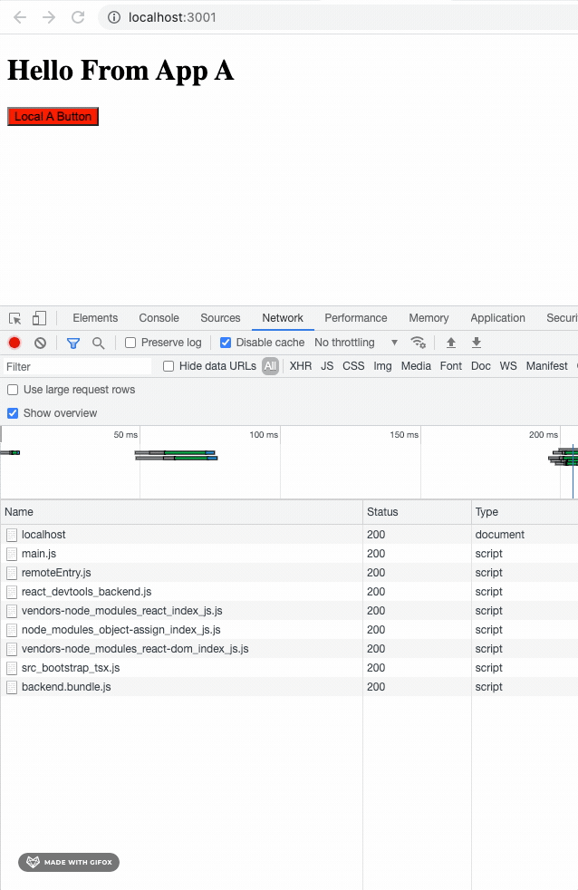

It is not uncommon for teams to end up in a position where they manage more than one web application. It is inevitable that at some point, teams will want to share a component between applications. \
\
In order to solve this, we would either:

1. Copy the component code from **App A** to **App B**
2. Build a component library and package that lib with both applications
3. Use a platform like [bit.dev](https://bit.dev/)

Option 1, is fairly straightforward -- but not scalable, it'll be really hard to keep the functionality in sync and at some stage could cost us twice the amount of effort to maintain, update and deploy changes.

Option 2, would work, but is costly to setup. I would also argue that you would suffer from the same pain points in Option 1. If you make an update to the component, it's inevitable that one will need to update and publish the central library, bump the version on all consuming apps and redeploy.

Option 3, is a little like Option 2, but the associated cost is a bit lower.

Webpack came up with a way to resolve this, using Module Federation. What this means in short, is that through Webpack, your applications can expose and consume code via the web platform. That means, you no longer need to bundle your applications with interdependencies, freeing you up from maintaining versions of a component in multiple services.

If I update a button on **App A**, then **App B** will automatically inherit the changes without having to redeploy. That's powerful. 

I created a [sample application](https://github.com/alettieri/webpack-federated-modules) repo to demo how one would go about sharing code between two resources.

